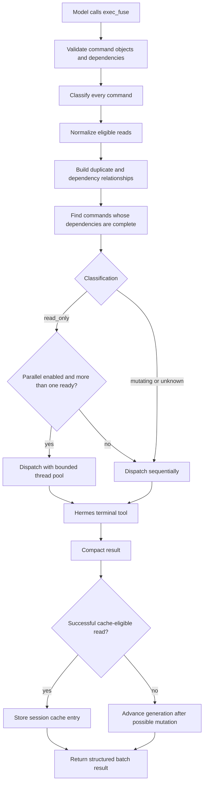

# Hermes Exec Fuse architecture

This document describes the `0.1.x` design and the safety boundaries future changes must preserve.

## Goals

Hermes Exec Fuse is designed to:

1. reduce repeated foreground terminal calls;
2. combine independent inspections into one model tool call;
3. parallelize only conservatively classified read-only commands;
4. reuse exact safe results without serving known-stale workspace data;
5. reduce terminal-result size deterministically;
6. preserve Hermes' approval and execution pipeline.

## Non-goals

The current implementation does not attempt to:

- prove arbitrary shell commands are side-effect free;
- execute outside Hermes' terminal tool;
- support interactive or background processes;
- persist command output across process restarts;
- infer semantic equivalence between different commands;
- replace Hermes' terminal or context-engine implementations.

## Component map

```text
plugin.yaml
    └── declares tools and hooks

__init__.py
    ├── registers exec_fuse and exec_fuse_stats
    ├── injects a short per-turn efficiency rule
    ├── observes direct terminal calls
    └── invalidates cache after known mutation tools

schemas.py
    └── defines the LLM-facing tool contract

classifier.py
    ├── normalizes superficial command whitespace
    └── classifies shell segments as read_only, mutating, or unknown

executor.py
    ├── validates command batches and dependency IDs
    ├── deduplicates normalized exact read-only commands
    ├── schedules ready commands
    ├── dispatches every real command through Hermes terminal
    └── returns compact structured results

state.py
    ├── stores session-scoped LRU cache entries
    ├── tracks workspace generations
    └── records execution and savings metrics

compressor.py
    └── deterministically reduces large strings and JSON-like results
```

## End-to-end flow



## Command classification

The classifier returns one of three values.

### `read_only`

A command is read-only only when all parsed shell segments are recognized inspections. This class may use:

- bounded parallel execution;
- session cache reuse;
- normalized exact duplicate elimination.

### `mutating`

A command is mutating when its executable or arguments indicate state changes. It runs sequentially, is never cached or deduplicated, and advances the workspace generation.

### `unknown`

Unknown means the plugin cannot confidently prove the command is read-only. Unknown commands remain allowed, but receive the same scheduling and invalidation treatment as mutating commands.

A false negative costs performance. A false positive could parallelize unsafe work or reuse stale data, so classification intentionally fails closed.

## Shell composition

Common shell operators are split and each segment is classified. A compound command is read-only only when every segment is read-only. Redirection, command substitution, unsafe quoting, or an unparseable segment causes conservative fallback.

A supplied `cwd` is separately included in cache identity and safely quoted when terminal arguments are built.

## Scheduling and dependencies

Each command has a unique `id` and optional `depends_on` IDs. The scheduler repeatedly:

1. finds pending commands whose dependencies have results;
2. skips commands with failed dependencies;
3. resolves normalized duplicates after their canonical command completes;
4. runs ready read-only commands concurrently when allowed;
5. runs mutating and unknown commands sequentially;
6. reports a dependency cycle when no pending command can become ready.

The read-only thread pool is capped at eight workers.

## Terminal dispatch boundary

The critical invariant is:

```python
ctx.dispatch_tool("terminal", terminal_args)
```

The plugin does not invoke `subprocess`, `os.system`, or a shell directly. Hermes therefore retains terminal backend selection, approval checks, credentials, redaction, timeout handling, and host-owned behavior.

A thread-local flag marks internal dispatches so direct-terminal hooks do not recursively intercept commands launched by `exec_fuse`.

## Cache identity

A cache fingerprint hashes canonical JSON containing:

```text
normalized command
working directory
timeout-related options
workspace generation
```

Intra-batch duplicate identity uses the same fields without generation.

Normalization deliberately remains shallow. Quotes, flag order, paths, and shell syntax are not rewritten.

## Cache scope and lifetime

| Setting | Default |
| --- | ---: |
| TTL | 300 seconds |
| Entries per session | 128 |
| Tracked sessions | 64 |

The state store uses an `RLock` and ordered dictionaries for bounded thread-safe LRU behavior. Cache entries contain compact output and metadata, not a separate full-output archive.

## Workspace generations

Every session starts at generation zero. A known or possible mutation advances the generation and clears that session's cache.

Generation changes after:

- an `exec_fuse` mutating or unknown command;
- a direct terminal command not classified as read-only;
- selected Hermes mutation surfaces: `write_file`, `patch`, `execute_code`, and `skill_manage`.

External changes outside the observed Hermes process cannot be detected automatically. The short TTL and per-command cache opt-out are deliberate safeguards.

## Direct terminal guard

The `pre_tool_call` hook observes ordinary foreground terminal calls. For a recognized read-only command, it computes the current fingerprint and checks the session cache.

When a match exists, the hook returns Hermes' supported block directive containing a cache-hit marker and the compact result. The hook cannot transparently substitute a successful result because the current API exposes block-or-allow behavior at this point.

The `post_tool_call` hook records successful direct read-only results. Failed reads affect metrics but are not cached. Other direct terminal commands invalidate the generation.

## Output compaction

Compaction is deterministic and tokenizer-independent. For oversized text it:

1. strips ANSI sequences;
2. keeps the first 24 lines;
3. selects up to 36 diagnostic middle lines;
4. keeps the final 18 lines;
5. removes duplicate selected lines;
6. inserts original line and character counts;
7. applies a final character head/tail fallback when needed.

JSON-like string values are compacted recursively and lists are capped at 100 items before final rendering.

## Failure semantics

A terminal result is currently considered failed when its dictionary or JSON object contains a truthy `error` field, or when dispatch raises an exception. This is intentionally simple and may require backend-specific normalization later.

Dependencies proceed only after `ok: true`. With `fail_fast: true`, any failure also skips later otherwise-ready commands.

## Metrics

Session metrics count:

- actual executions;
- cache hits;
- intra-batch duplicate hits;
- avoided calls;
- raw result characters observed;
- compact characters returned;
- estimated characters saved.

These are character counts, not exact tokens.

## Design invariants

Future changes must preserve:

1. Real commands always use Hermes tool dispatch.
2. Only positively recognized read-only commands may run concurrently or be cached.
3. Unknown behavior falls back to sequential execution and invalidation.
4. Cache identity includes workspace generation.
5. Classifier changes include adversarial neighboring tests.
6. Output compaction remains deterministic and diagnostic-first.
7. State remains bounded and thread-safe.
8. Hooks cannot crash the parent agent loop.
