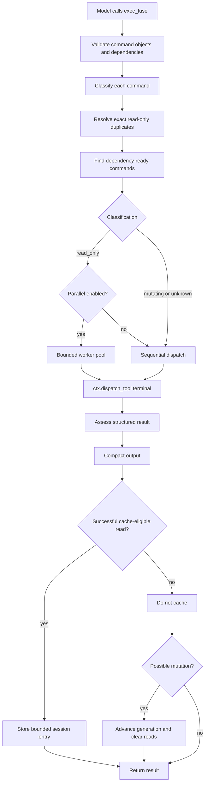

# Hermes Exec Fuse architecture

This document describes the `0.2.x` runtime and its safety invariants.

## Component map

```text
plugin.yaml
    └── declares exec_fuse, stats, cache-control, and lifecycle hooks

__init__.py
    ├── loads bounded environment configuration
    ├── registers tools and hooks
    ├── guards repeated direct terminal reads
    └── invalidates state after known mutation tools

config.py
    └── parses and clamps non-secret process configuration

classifier.py
    └── classifies commands as read_only, mutating, or unknown

result_status.py
    └── normalizes structured backend success and failure signals

executor.py
    ├── validates command DAGs
    ├── schedules ready commands
    ├── delegates every command through Hermes terminal
    ├── applies cache and generation rules
    └── returns compact structured results

state.py
    ├── bounded session LRU cache
    ├── workspace generations
    └── execution, timing, compression, and reuse metrics

compressor.py
    └── deterministic diagnostic-first output reduction
```

## Execution flow



## Classification

A command is `read_only` only when every parsed shell segment is positively recognized as inspection-only. This class may run concurrently, be deduplicated, and reuse cache entries.

`mutating` commands are recognized state-changing operations. `unknown` means the plugin cannot prove safety. Both classes run sequentially and advance the workspace generation.

This fail-closed choice deliberately prefers missed optimization over unsafe parallelism or stale reuse.

## Dispatch boundary

The critical invariant is:

```python
ctx.dispatch_tool("terminal", terminal_args)
```

No runtime path calls `subprocess`, `os.system`, or a shell directly. Hermes remains responsible for approval, credentials, redaction, timeout behavior, and terminal backend selection.

A thread-local marker prevents the plugin's direct-terminal hooks from recursively intercepting commands dispatched by `exec_fuse`.

## Result normalization

Terminal backends may return dictionaries, JSON strings, or ordinary text. `result_status.py` interprets only structured signals:

- truthy `error`;
- `ok: false` or `success: false`;
- non-zero `exit_code`, `return_code`, or `returncode`;
- a known failure `status`.

Ordinary text is treated as successful because scanning arbitrary output for words such as “error” would create false positives in logs, tests, and source code.

Failure assessment controls cache eligibility and dependency progression. Failed results are still compacted and recorded in metrics.

## Cache identity and lifetime

A cache fingerprint hashes canonical JSON containing:

```text
normalized command
working directory
timeout options
workspace generation
```

Intra-batch duplicate identity omits generation because all duplicates belong to one scheduler execution.

The default cache is session-scoped, in memory, five minutes, 128 entries per session, and 64 sessions. Environment configuration may adjust these values within hard bounds. TTL zero disables reuse.

## Workspace generations

Each session starts at generation zero. Generation advances after:

- mutating or unknown `exec_fuse` commands;
- direct terminal commands not classified as read-only;
- selected Hermes mutation tools (`write_file`, `patch`, `execute_code`, `skill_manage`);
- explicit `exec_fuse_clear_cache` calls.

Advancing generation clears current cache entries and changes future fingerprints.

External filesystem changes cannot be observed automatically. Users can disable reuse per command or explicitly clear the session cache.

## Configuration

`FuseConfig` is immutable and loaded once during plugin import. Integer settings are clamped, booleans accept a small explicit vocabulary, and invalid values fall back to defaults.

Configuration contains no credentials and is safe to expose through `exec_fuse_stats`.

## Scheduling

The scheduler repeatedly:

1. finds pending commands whose dependencies have results;
2. skips failed dependency descendants;
3. resolves normalized duplicates from their canonical result;
4. submits ready read-only commands to a bounded thread pool;
5. runs mutating and unknown commands sequentially;
6. reports a dependency cycle when no command can become ready.

The configured worker count is always capped at 32 and by the number of ready reads.

## Output compaction

Compaction is deterministic and tokenizer-independent. Oversized text retains head lines, diagnostic middle lines, tail lines, and an original-size marker. ANSI sequences are removed. JSON string values are compacted recursively and lists are bounded.

The plugin stores compact output only; it does not retain an additional raw-output archive.

## Metrics

Session metrics include actual executions, success/failure counts, executions by classification, reuse and duplicate hits, avoided calls, generation bumps, raw and returned characters, total duration, reuse rate, compression ratio, and average execution time.

These are operational character/time metrics, not exact token billing measurements.

## Import compatibility

A standalone Hermes plugin requires `__init__.py` at repository root. Pytest may import that file without a package name while discovering tests. A narrow synthetic-package compatibility branch supports that collection mode; normal Hermes package loading does not use it.

## Design invariants

Future changes must preserve:

1. Every real command uses Hermes dispatch.
2. Only positively recognized reads may run concurrently or be reused.
3. Unknown behavior falls back to sequential execution and invalidation.
4. Failed results are never cached.
5. Cache identity includes workspace generation.
6. Configuration remains bounded and non-secret.
7. State remains bounded and thread-safe.
8. Compaction remains deterministic and diagnostic-first.
9. Hooks cannot crash the parent agent loop.
